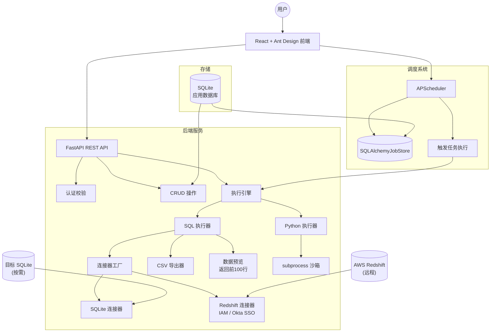
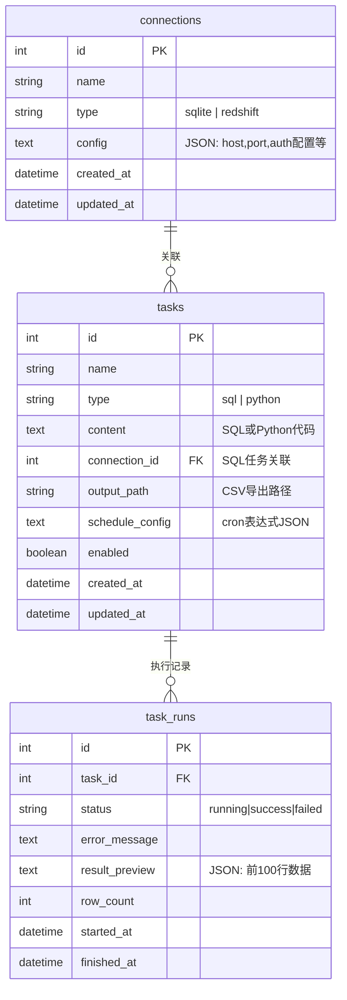
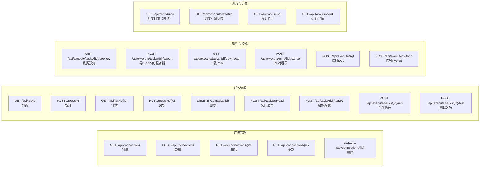

# Ghost Flow Work App — 任务计划调度系统

## 项目概述

一个基于 Web 的任务计划调度工具，支持：
- 定时运行 Python 脚本
- 通过 SQL 从 SQLite / AWS Redshift 获取数据
- 用户复制粘贴 SQL 或 Python 代码创建自动任务
- 可保存多种数据库连接配置（SQLite、Redshift IAM、Redshift Okta SSO）
- SQL 任务结果导出为 CSV 及页面数据预览

---

## 技术栈

| 层 | 技术 | 说明 |
|---|---|---|
| 前端 | React 19 + TypeScript + Ant Design 6 | UI 框架 |
| 代码编辑器 | 原生 TextArea（Monaco Editor 待后续集成） | SQL / Python 编辑 |
| 后端框架 | FastAPI + Python 3.11+ | REST API |
| ORM | SQLAlchemy 2.0 | 数据库交互 |
| 调度引擎 | APScheduler + SQLAlchemyJobStore | Cron 任务调度 |
| SQL 执行 | `redshift-connector` + `sqlalchemy` | 支持 IAM 与 Okta SSO |
| Python 执行 | `subprocess` 隔离沙箱 | 安全执行用户代码 |
| 数据导出 | pandas → CSV | 导出查询结果 |
| 应用数据库 | SQLite | 自身元数据存储（零配置） |

---

## 整体架构



---

## 应用数据库设计



---

## 目录结构

```
ghost-flow-work-app/
├── plan.md
├── README.md
├── AGENTS.md
├── backend/
│   ├── pyproject.toml
│   ├── uv.lock
│   ├── alembic.ini
│   ├── alembic/
│   │   ├── env.py
│   │   ├── script.py.mako
│   │   └── versions/
│   └── app/
│       ├── __init__.py
│       ├── main.py                   # FastAPI 入口
│       ├── core/
│       │   ├── __init__.py
│       │   ├── config.py             # Pydantic Settings
│       │   ├── database.py           # 引擎 & Session
│       │   └── logging.py            # loguru 日志配置
│       ├── models/
│       │   ├── __init__.py
│       │   ├── connection.py
│       │   ├── task.py
│       │   └── task_run.py
│       ├── schemas/
│       │   ├── __init__.py
│       │   ├── connection.py
│       │   ├── task.py
│       │   └── task_run.py
│       ├── api/
│       │   ├── __init__.py
│       │   ├── router.py
│       │   └── endpoints/
│       │       ├── __init__.py
│       │       ├── connections.py    # /api/connections
│       │       ├── tasks.py          # /api/tasks
│       │       ├── schedules.py      # /api/schedules
│       │       ├── task_runs.py      # /api/task-runs
│       │       └── execute.py        # /api/execute
│       └── services/
│           ├── __init__.py
│           ├── connector/
│           │   ├── __init__.py
│           │   ├── base.py
│           │   ├── sqlite_connector.py
│           │   └── redshift_connector_impl.py
│           ├── executor/
│           │   ├── __init__.py
│           │   ├── sql_executor.py
│           │   └── python_executor.py
│           ├── scheduler.py          # APScheduler 调度管理
│           ├── task_runner.py        # 任务执行编排
│           ├── run_tracker.py        # 运行时任务追踪与取消
│           ├── csv_exporter.py
│           ├── data_preview.py
│           └── deps_installer.py     # Python 依赖自动安装
├── frontend/
│   ├── package.json
│   ├── tsconfig.json
│   ├── vite.config.ts
│   └── src/
│       ├── main.tsx
│       ├── App.tsx
│       ├── api/
│       │   ├── client.ts
│       │   ├── connections.ts
│       │   ├── tasks.ts
│       │   ├── execute.ts
│       │   ├── schedules.ts
│       │   └── task-runs.ts
│       ├── pages/
│       │   ├── Dashboard/
│       │   │   └── index.tsx
│       │   ├── Connections/
│       │   │   ├── index.tsx
│       │   │   └── ConnectionForm.tsx
│       │   ├── Tasks/
│       │   │   ├── index.tsx
│       │   │   ├── TaskForm.tsx
│       │   │   └── DataPreview.tsx
│       │   ├── Schedules/
│       │   │   └── index.tsx
│       │   └── History/
│       │       └── index.tsx
│       └── components/
│           ├── AppLayout.tsx
│           └── ErrorBoundary.tsx
└── data/
    └── .gitkeep
```

---

## API 设计



---

## Redshift 连接配置

### 方式一：IAM 认证

```json
{
  "type": "redshift",
  "host": "xxx.xxxxxx.redshift.amazonaws.com",
  "port": 5439,
  "database": "dev",
  "user": "awsuser",
  "auth_type": "iam",
  "aws_access_key_id": "AKIA...",
  "aws_secret_access_key": "...",
  "region": "us-east-1",
  "cluster_identifier": "my-cluster"
}
```

实现：`redshift-connector` 配合 IAM 认证，通过 AWS STS 获取临时凭证。

### 方式二：Okta SSO 认证

```json
{
  "type": "redshift",
  "host": "xxx.xxxxxx.redshift.amazonaws.com",
  "port": 5439,
  "database": "dev",
  "user": "user@company.com",
  "password": "...",
  "auth_type": "okta",
  "idp_tenant": "https://your-org.okta.com",
  "client_id": "0oa...",
  "plugin_name": "com.okta.redshift.okta_credentials_provider"
}
```

实现：`redshift-connector` 原生支持 `OktaCredentialsProvider`，传递 `idp_tenant`、`client_id`、`plugin_name` 即可自动完成 SAML 握手 → STS 临时凭证 → Redshift 连接。

---

## 实施阶段

### Phase 1 — 项目脚手架 + 数据库模型 + 连接管理 CRUD

| 任务 | 后端 | 前端 |
|---|---|---|
| 1.1 | FastAPI 项目骨架，SQLite 引擎，数据表创建 | — |
| 1.2 | Connection 模型 + CRUD API | 连接列表、新建/编辑表单 |
| 1.3 | 前端项目骨架，Layout，路由 | — |
| 1.4 | CORS 配置，前后端联调 | Axios 封装 |

目标：用户可新增/编辑/删除 SQLite 和 Redshift 两种连接配置。

### Phase 2 — 执行引擎 + 数据预览 + CSV 导出

| 任务 | 后端 | 前端 |
|---|---|---|
| 2.1 | SQLite 连接器实现 | — |
| 2.2 | Redshift IAM + Okta 连接器实现 | — |
| 2.3 | SQL 执行引擎（返回 DataFrame） | — |
| 2.4 | Python 执行引擎（subprocess 沙箱） | — |
| 2.5 | 数据预览 API（前100行 + 列信息） | 数据预览表格 |
| 2.6 | CSV 导出 API | 导出按钮 |
| 2.7 | Task 模型 + CRUD API | 任务列表、SQL/Python 编辑器 |
| 2.8 | 手动执行 API | 执行按钮 + 结果展示 |

目标：用户可写 SQL/Python → 选连接 → 执行 → 预览数据 → 导出 CSV。

### Phase 3 — 调度系统

| 任务 | 后端 | 前端 |
|---|---|---|
| 3.1 | APScheduler 集成 + SQLAlchemyJobStore | — |
| 3.2 | 任务级调度配置（cron + timezone）+ 启停 API | 调度配置 UI |
| 3.3 | Cron 表达式透传至 `CronTrigger.from_crontab()`（未做自定义解析器） | 基础 Cron 输入框 |
| 3.4 | 任务执行时自动记录 TaskRun | 执行历史列表 |
| 3.5 | 调度器启动/停止/状态 API | 仪表盘概览 |

说明：当前没有独立的 `Schedule` 实体，调度配置内嵌在 `Task.schedule_config` 中，启停通过 `/api/tasks/{id}/toggle` 控制，`/api/schedules` 仅提供只读列表与状态。

目标：用户可配置定时任务，查看执行历史。

### Phase 4 — 打磨优化

| 任务 | 内容 |
|---|---|
| 4.1 | 错误处理优化，Toast 通知 |
| 4.2 | 后端日志系统（loguru） |
| 4.3 | 任务执行超时控制 |
| 4.4 | 前端加载态、空态、错误边界 |
| 4.5 | 仪表盘数据统计 |
| 4.6 | Redshift IAM 认证修复 |
| 4.7 | 运行中任务真正取消（SQL future / Python 子进程） |
| 4.8 | 任务级并发控制 |
| 4.9 | Alembic 数据库迁移 |
| 4.10 | README / plan.md 文档同步 |

---

## 任务执行流程

```mermaid
sequenceDiagram
    participant U as 用户
    participant FE as 前端
    participant API as FastAPI
    participant Sched as APScheduler
    participant Exec as 执行引擎
    participant DB as 目标数据库

    Note over U,DB: 手动执行
    U->>FE: 点击「执行」
    FE->>API: POST /api/tasks/{id}/run
    API->>Exec: 执行任务
    Exec->>DB: 连接并执行 SQL
    DB-->>Exec: 返回数据 (DataFrame)
    Exec->>API: 返回结果 + 预览数据
    API-->>FE: { status, preview, row_count }
    FE-->>U: 展示数据预览

    Note over U,DB: 定时调度
    Sched->>Exec: 定时触发
    Exec->>DB: 执行 SQL
    DB-->>Exec: 返回数据
    Exec->>API: 记录 task_runs
    Exec->>CSV: 导出到指定路径

---

## 开发规范

- 所有代码注释、文档、沟通使用 **中文**
- 前端使用函数式组件 + Hooks，遵循 Ant Design 最佳实践
- 后端遵循 FastAPI 官方规范，使用 Pydantic v2 做数据校验
- 数据库迁移使用 Alembic
- 前后端通过 RESTful JSON API 通信
- Python 包管理使用 `uv add`，前端使用 pnpm
- 后端通过 `uv run` 启动

---

## 当前状态

- [x] Phase 1 — 脚手架 + 数据库 + 连接管理 CRUD
- [x] Phase 2 — 执行引擎 + 预览 + CSV 导出
- [x] Phase 3 — 调度系统
- [x] Phase 4 — 打磨优化

---

### Phase 4 完成内容

- 后端日志系统 (loguru)：控制台彩色输出 + 文件轮转 10MB/保留30天
- SQL 执行超时控制：`ThreadPoolExecutor` + 300秒默认超时
- Python 执行超时控制：subprocess `timeout` 参数
- 前端 ErrorBoundary：全局错误捕获，显示重试按钮
- 连接表单增加配置模板按钮（SQLite / IAM / Okta SSO 一键填入）
- 任务表单增加连接选择为空提示
- 运行历史完整表格展示
- Redshift IAM 认证修复：支持 `aws_access_key_id`、`aws_secret_access_key`、`region`、`cluster_identifier`、`aws_session_token`
- 任务真正取消：`/api/execute/runs/{id}/cancel` 可终止 Python 子进程 / SQL 执行 future
- 任务级并发控制：同一任务调度触发与手动触发互斥
- Alembic 数据库迁移：`alembic.ini` + baseline migration 已就位
- 文档同步：`README.md` / `plan.md` 技术栈、目录结构、API 设计与实现一致

---

## 启动方式

```bash
# 后端 (backend/)
uv sync
uv run alembic upgrade head   # 新环境首次执行
uv run uvicorn app.main:app --reload --port 8000

# 前端 (frontend/)
pnpm install
pnpm dev
```

前端访问 http://localhost:5173 ，API 通过 Vite proxy 自动转发到后端 8000 端口。

